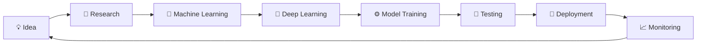

<!-- ===================================================== -->
<!--               CYBERPUNK GITHUB PROFILE                -->
<!--                Created by ChatGPT x Rishabh           -->
<!-- ===================================================== -->

<div align="center">


</div>

---

<div align="center">

#  Welcome to my AI Laboratory


</div>

---

<div align="center">

<a href="https://github.com/rishabhverma007">

</a>

<a href="https://github.com/rishabhverma007">

</a>

<a href="https://github.com/rishabhverma007?tab=repositories">

</a>

<a href="https://www.oracle.com/">

</a>

</div>

---

#  SYSTEM STATUS

<table>

<tr>

<td width="50%">

```yaml
━━━━━━━━━━━━━━━━━━━━━━━━━━━━━━━

SYSTEM INITIALIZATION

━━━━━━━━━━━━━━━━━━━━━━━━━━━━━━━

NAME        :: RISHABH VERMA

ROLE        :: AI ENGINEER

STATUS      :: ONLINE

VERSION     :: 3.0.1

LOCATION    :: INDIA 🇮🇳

MISSION     :: BUILD INTELLIGENT SYSTEMS

FOCUS       ::
   • MACHINE LEARNING
   • DEEP LEARNING
   • LLM ENGINEERING
   • COMPUTER VISION

POWER LEVEL ::
████████████████████ 100%

━━━━━━━━━━━━━━━━━━━━━━━━━━━━━━━
```

</td>

<td width="50%">


</td>

</tr>

</table>

---

<div align="center">

## ⚡ CURRENT OBJECTIVES

</div>

<table>

<tr>

<td align="center">

🧠

### Master AI

Deep Learning

Transformers

Diffusion Models

</td>

<td align="center">

🤖

### Build

AI Products

AI Agents

LLM Apps

</td>

<td align="center">

☁️

### Deploy

Docker

Cloud

MLOps

</td>

<td align="center">

🚀

### Career

Top AI/ML Engineer

Open Source

Research

</td>

</tr>

</table>

---

<div align="center">

## 🌌 CYBER TERMINAL

</div>

```text
> boot AI_PROFILE.exe

Loading Neural Networks............. ██████████████ 100%

Loading Deep Learning Modules....... ██████████████ 100%

Loading Computer Vision............. ██████████████ 100%

Loading Large Language Models....... ██████████████ 100%

Loading Open Source Projects........ ██████████████ 100%

Initializing Developer Mode......... ██████████████ 100%

STATUS : ONLINE

MISSION : BUILD AI FOR THE FUTURE

READY.
```

---

<div align="center">


</div>
<!-- ===================================================== -->
<!--              PART 2 : AI OPERATING SYSTEM             -->
<!-- ===================================================== -->

<div align="center">

# 🤖 AI OPERATING SYSTEM


</div>

---

<table>

<tr>

<td width="45%" valign="top">

## 👨‍💻 DEVELOPER PROFILE

```yaml
━━━━━━━━━━━━━━━━━━━━━━━━━━━━━━

NAME:
➜ Rishabh Verma

ROLE:
➜ AI / ML Engineer

EDUCATION:
➜ B.Tech CSE (Artificial Intelligence)

UNIVERSITY:
➜ Babu Banarasi Das University

LOCATION:
➜ Uttar Pradesh 🇮🇳

CURRENT STATUS:
🟢 ONLINE

MISSION:
Design AI that solves
real-world problems.

SPECIALIZATION:
✔ Machine Learning
✔ Deep Learning
✔ Computer Vision
✔ Generative AI
✔ LLM Applications

━━━━━━━━━━━━━━━━━━━━━━━━━━━━━━
```

</td>

<td width="55%" valign="top">

## ⚡ AI DASHBOARD

| MODULE | STATUS |
|:------|:------:|
| 🧠 Machine Learning | 🟢 ONLINE |
| 🤖 Deep Learning | 🟢 ONLINE |
| 👁 Computer Vision | 🟢 ONLINE |
| 💬 NLP | 🟢 ONLINE |
| ⚡ LLM Engineering | 🟢 ONLINE |
| 🚀 AI Deployment | 🟡 LEARNING |
| ☁ Cloud Computing | 🟢 ONLINE |
| 🔥 Open Source | 🟢 ACTIVE |

</td>

</tr>

</table>

---

# 🧠 SPECIALIZATION MATRIX

<table>

<tr>

<td width="50%">

### ⚡ AI Core

```text
Machine Learning

██████████████████████ 95%

Deep Learning

████████████████████ 90%

Computer Vision

███████████████████ 88%

Generative AI

██████████████████ 87%

Large Language Models

██████████████████ 90%
```

</td>

<td width="50%">

### 🚀 Development

```text
Python

██████████████████████ 98%

Flask

███████████████████ 90%

Django

██████████████████ 85%

SQL

█████████████████ 82%

Git & GitHub

████████████████████ 92%
```

</td>

</tr>

</table>

---

# 🌌 ABOUT ME

<div align="center">

> ## "Turning ideas into intelligent systems."

</div>

```text
> whoami

I'm an Artificial Intelligence undergraduate and Oracle Certified
Data Science Professional passionate about building intelligent,
scalable, and impactful AI systems.

I enjoy developing projects involving:

✔ Machine Learning

✔ Deep Learning

✔ Computer Vision

✔ Generative AI

✔ Large Language Models

✔ AI-powered Web Applications

My goal is to contribute to cutting-edge AI research while building
products that positively impact millions of users.
```

---

# ⚙ CURRENT LEARNING PATH

<div align="center">

| 🚀 Technology | Progress |
|--------------|---------|
| Advanced Deep Learning | ████████████░░ 85% |
| Transformer Models | ███████████░░░ 80% |
| MLOps | ██████████░░░░ 70% |
| LangChain | ████████████░░ 85% |
| AI Agents | ███████████░░░ 82% |
| Multi-Agent Systems | █████████░░░░ 65% |
| RAG Applications | ███████████░░░ 80% |
| Computer Vision | █████████████░ 90% |

</div>

---

# 🎯 CURRENT MISSION

```python
class RishabhVerma:

    def __init__(self):

        self.role = "AI Engineer"

        self.learning = [
            "Machine Learning",
            "Deep Learning",
            "Computer Vision",
            "Generative AI",
            "Large Language Models",
            "AI Agents",
            "MLOps"
        ]

        self.goal = (
            "Build AI solutions that solve "
            "real-world problems."
        )

    def mission(self):

        return "Learn → Build → Deploy → Repeat 🚀"

me = RishabhVerma()

print(me.mission())
```

---

<div align="center">

# ⚡ AI MOTTO

### **"Code. Learn. Build. Innovate. Repeat."**


</div>
<!-- ===================================================== -->
<!--               PART 3 : AI ARSENAL                     -->
<!-- ===================================================== -->

<div align="center">

# ⚡ AI ARSENAL


</div>

---

<div align="center">

# 🧠 CORE PROGRAMMING


</div>

---

<div align="center">

# 🤖 ARTIFICIAL INTELLIGENCE


</div>

---

<div align="center">

# 🌐 WEB DEVELOPMENT


</div>

---

<div align="center">

# ☁ CLOUD • DEVOPS • DATABASE


</div>

---

<div align="center">

# 🛠 DEVELOPMENT TOOLS


</div>

---

# ⚡ TECHNOLOGY MATRIX

<table>

<tr>

<td width="50%">

## 🧠 AI & DATA SCIENCE

```text
Machine Learning
██████████████████████ 95%

Deep Learning
████████████████████ 92%

Computer Vision
███████████████████ 90%

Large Language Models
██████████████████ 88%

Generative AI
██████████████████ 90%

Natural Language Processing
█████████████████ 85%
```

</td>

<td width="50%">

## 💻 SOFTWARE ENGINEERING

```text
Python
██████████████████████ 98%

Flask
███████████████████ 92%

Django
██████████████████ 88%

REST APIs
██████████████████ 90%

Git & GitHub
████████████████████ 94%

Docker
█████████████████ 82%
```

</td>

</tr>

</table>

---

# 🚀 DEVELOPMENT ECOSYSTEM

<div align="center">

| CATEGORY | TECHNOLOGIES |
|:---------|:-------------|
| 🧠 AI | TensorFlow • PyTorch • Scikit-Learn • Hugging Face • OpenCV |
| 🤖 LLM | Gemini • Ollama • LangChain • Transformers |
| 🌐 Backend | Flask • Django • FastAPI |
| 💻 Languages | Python • C++ • SQL • JavaScript |
| ☁ Cloud | Google Cloud • Oracle Cloud |
| 🛠 Tools | Git • Docker • Linux • VS Code • Postman |
| 📊 Data | Pandas • NumPy • Matplotlib • Seaborn |

</div>

---

# ⚙ AI LOADOUT

<div align="center">

| ⚡ MODULE | STATUS |
|:---------|:------:|
| Machine Learning | 🟢 ACTIVE |
| Deep Learning | 🟢 ACTIVE |
| Computer Vision | 🟢 ACTIVE |
| LLM Engineering | 🟢 ACTIVE |
| AI Agents | 🟡 IN PROGRESS |
| MLOps | 🟡 LEARNING |
| Cloud Deployment | 🟢 ACTIVE |
| Open Source | 🟢 CONTRIBUTING |

</div>

---

<div align="center">

## ⚡ TECHNOLOGY PHILOSOPHY

```text
Think.

Learn.

Build.

Deploy.

Optimize.

Repeat.
```


</div>
<!-- ===================================================== -->
<!--              PART 4 : FEATURED PROJECTS               -->
<!-- ===================================================== -->

<div align="center">

# 🚀 FEATURED PROJECTS


</div>

---

# 🧬 PROJECT 01 • VisionFit AI

<div align="center">


### 🏋️ AI-Powered Personal Fitness Coach

**Computer Vision • Pose Detection • LLMs • Flask**

</div>

<table>

<tr>

<td width="55%" valign="top">

## 🌟 Overview

An AI-powered health and fitness platform that combines
Computer Vision, MediaPipe, OpenCV, Google Gemini,
and Local LLMs to provide a fully personalized
fitness experience.

### ✨ Features

✅ Real-time Pose Detection

✅ Exercise Rep Counter

✅ Form Correction

✅ AI Workout Planner

✅ AI Meal Planner

✅ Voice Assistant

✅ Google Fit Integration

✅ Progress Analytics

</td>

<td width="45%" valign="top">

## ⚙ Tech Stack

```yaml
Python

Flask

OpenCV

MediaPipe

Google Gemini

Ollama

Llama 3

Chart.js

REST APIs
```

</td>

</tr>

</table>

<div align="center">

### 🛠 Technologies


</div>

---

# 📚 PROJECT 02 • Personal AI Study Companion

<div align="center">


### 🎓 Generative AI Learning Platform

</div>

<table>

<tr>

<td width="55%">

## 🌟 Overview

A Flask-based educational platform powered by
Generative AI to help students learn smarter,
summarize PDFs, generate notes, and collaborate.

### ✨ Features

📄 AI PDF Chat

📝 Smart Notes

🤖 Gemini Integration

💬 Group Chat

📚 Personalized Learning

⚡ REST APIs

</td>

<td width="45%">

## ⚙ Tech Stack

```yaml
Python

Flask

Gemini API

Pollinations AI

REST APIs

SQLite

HTML

CSS

JavaScript
```

</td>

</tr>

</table>

<div align="center">


</div>

---

# 🏛 PROJECT 03 • College ERP System

<div align="center">


### 🎯 Enterprise Academic Management Platform

</div>

<table>

<tr>

<td width="55%">

## 🌟 Overview

A full-stack ERP platform for colleges
built using Django and REST Framework.

### ✨ Features

🎓 Student Management

📅 Attendance

💰 Fee Management

📊 Analytics Dashboard

📚 Course Enrollment

🔐 Authentication

📈 Reporting

</td>

<td width="45%">

## ⚙ Tech Stack

```yaml
Python

Django

Django REST

SQLite

Chart.js

HTML

CSS

JavaScript
```

</td>

</tr>

</table>

<div align="center">


</div>

---

# 💎 PROJECT ECOSYSTEM

<div align="center">

| 🚀 Project | 🤖 AI | 🌐 Web | ☁ Cloud | ⭐ Status |
|:-----------|:----:|:------:|:-------:|:--------:|
| VisionFit AI | ✅ | ✅ | ✅ | 🚀 Active |
| AI Study Companion | ✅ | ✅ | 🟡 | 🚀 Active |
| College ERP | ❌ | ✅ | 🟡 | 🚀 Active |

</div>

---

# 📊 DEVELOPMENT TIMELINE

```text
2023
│
├── Python
├── Machine Learning
│
2024
│
├── Deep Learning
├── Computer Vision
├── VisionFit AI
│
2025
│
├── LLM Engineering
├── AI Study Companion
├── College ERP
│
2026 →
│
├── AI Agents
├── LangChain
├── MLOps
├── Production AI Systems
│
▼
Future
```

---

<div align="center">

## 🌌 PROJECT PHILOSOPHY

> **"Every project is an opportunity to transform ideas into intelligent solutions."**


</div>
<!-- ===================================================== -->
<!--          PART 5 : CERTIFICATIONS & ACHIEVEMENTS       -->
<!-- ===================================================== -->

<div align="center">

# 🏆 CERTIFICATIONS • ACHIEVEMENTS • AI PROFILE


</div>

---

# 🏅 CERTIFICATION VAULT

<table>

<tr>

<td width="50%">

## ☁ Oracle


<br><br>

✔ Oracle Cloud Infrastructure 2025

✔ Data Science Professional

✔ Machine Learning

✔ AI Pipelines

✔ Model Deployment

</td>

<td width="50%">

## 🤖 Oracle AI


<br><br>

✔ Artificial Intelligence

✔ Machine Learning Basics

✔ OCI AI Services

✔ Neural Networks

✔ AI Fundamentals

</td>

</tr>

<tr>

<td>

## 🎓 Coursera


<br><br>

✔ Machine Learning

✔ Model Evaluation

✔ Regression

✔ Classification

✔ Data Analysis

</td>

<td>

## 🌐 Cisco


<br><br>

✔ Data Science

✔ Data Analytics

✔ Statistics

✔ Python

✔ Visualization

</td>

</tr>

</table>

---

# 🚀 AI ENGINEER PROFILE

<div align="center">

| CATEGORY | LEVEL |
|:---------|:------:|
| 🧠 Artificial Intelligence | ⭐⭐⭐⭐⭐ |
| 🤖 Machine Learning | ⭐⭐⭐⭐⭐ |
| 👁 Computer Vision | ⭐⭐⭐⭐⭐ |
| 💬 NLP | ⭐⭐⭐⭐☆ |
| ⚡ LLM Engineering | ⭐⭐⭐⭐⭐ |
| ☁ Cloud Computing | ⭐⭐⭐⭐☆ |
| 🐳 Docker | ⭐⭐⭐⭐☆ |
| 🌐 Backend Development | ⭐⭐⭐⭐⭐ |

</div>

---

# 📈 PROFESSIONAL MATRIX

<table>

<tr>

<td width="50%">

### ⚡ Technical Skills

```text
Python
█████████████████████████ 98%

Machine Learning
███████████████████████ 95%

Deep Learning
█████████████████████ 92%

Computer Vision
████████████████████ 90%

Large Language Models
███████████████████ 90%
```

</td>

<td width="50%">

### 🚀 Engineering Skills

```text
Backend Development
█████████████████████ 92%

REST APIs
████████████████████ 90%

Git & GitHub
██████████████████████ 96%

Cloud Computing
██████████████████ 85%

Docker
█████████████████ 80%
```

</td>

</tr>

</table>

---

# 🎯 CORE COMPETENCIES

<div align="center">

| 🤖 AI | 🌐 Development | ☁ Cloud |
|:-----|:--------------|:--------|
| Machine Learning | Flask | Google Cloud |
| Deep Learning | Django | Oracle Cloud |
| Computer Vision | FastAPI | Docker |
| LLMs | REST APIs | Linux |
| Generative AI | SQL | GitHub Actions |
| NLP | Git | CI/CD |

</div>

---

# 🏆 ACHIEVEMENT DASHBOARD

```text
━━━━━━━━━━━━━━━━━━━━━━━━━━━━━━━━━━━━━━━━━━

AI PROJECTS COMPLETED

██████████████████████

Machine Learning Projects

██████████████████████

Deep Learning Models

████████████████████

Computer Vision Systems

███████████████████

Generative AI Applications

██████████████████

━━━━━━━━━━━━━━━━━━━━━━━━━━━━━━━━━━━━━━━━━━
```

---

# 🛡 ENGINEERING PRINCIPLES

```yaml
✔ Clean Code

✔ Scalable Architecture

✔ Continuous Learning

✔ Open Source

✔ AI Ethics

✔ Performance Optimization

✔ Documentation

✔ Problem Solving

✔ Research Mindset
```

---

# 📅 CAREER TIMELINE

```text
2023

Started B.Tech AI

↓

Python

↓

Data Structures

↓

Machine Learning

━━━━━━━━━━━━━━━━━━━━━━━

2024

Deep Learning

↓

Computer Vision

↓

Flask Development

↓

VisionFit AI

━━━━━━━━━━━━━━━━━━━━━━━

2025

Large Language Models

↓

AI Study Companion

↓

College ERP

↓

Oracle Certifications

━━━━━━━━━━━━━━━━━━━━━━━

2026

AI Agents

↓

LangChain

↓

MLOps

↓

Production AI Systems

━━━━━━━━━━━━━━━━━━━━━━━

NEXT TARGET

Senior AI Engineer 🚀
```

---

<div align="center">

# ⚡ DEVELOPER PHILOSOPHY

```python
while True:

    Learn()

    Experiment()

    Build()

    Deploy()

    Improve()

    Repeat()
```

### 💎 *"Artificial Intelligence is not just about building models—it's about creating solutions that make a real impact."*


</div>
<!-- ===================================================== -->
<!--           PART 6 : MISSION CONTROL DASHBOARD          -->
<!-- ===================================================== -->

<div align="center">

# 🌌 MISSION CONTROL


</div>

---

<div align="center">

# 📡 LIVE GITHUB ANALYTICS

</div>

<table>
<tr>

<td width="50%">


</td>

<td width="50%">


</td>

</tr>
</table>

---

<div align="center">

# 🧠 LANGUAGE MATRIX


</div>

---

<div align="center">

# 📈 CONTRIBUTION GRAPH


</div>

---

<div align="center">

# 🏆 TROPHY CABINET


</div>

---

<div align="center">

# ⚡ PROFILE INSIGHTS

<table>

<tr>

<td align="center">

### 👨‍💻

Repositories

</td>

<td align="center">

### ⭐

Stars

</td>

<td align="center">

### 🍴

Forks

</td>

<td align="center">

### 🤝

Followers

</td>

</tr>

</table>

</div>

---

# 🤖 AI ENGINE STATUS

```yaml
━━━━━━━━━━━━━━━━━━━━━━━━━━━━━━━

STATUS          :: ONLINE

AI MODULES      :: ACTIVE

REPOSITORIES    :: SYNCHRONIZED

OPEN SOURCE     :: ENABLED

BUILD STATUS    :: PASSING

CI/CD           :: READY

SYSTEM HEALTH   :: 100%

━━━━━━━━━━━━━━━━━━━━━━━━━━━━━━━
```

---

# 🚀 DEVELOPMENT ACTIVITY

```text
BOOTING...

██████████████████████████ 100%

Loading GitHub API....

██████████████████████████ 100%

Loading Contributions....

██████████████████████████ 100%

Loading Projects....

██████████████████████████ 100%

Loading AI Models....

██████████████████████████ 100%

MISSION CONTROL READY

STATUS:
🟢 ONLINE
```

---

<div align="center">

# 📊 ENGINEER METRICS

| Metric | Status |
|:-------|:------:|
| 🚀 Active Development | 🟢 |
| 🧠 AI Research | 🟢 |
| 🤖 LLM Engineering | 🟢 |
| 🌐 Backend Development | 🟢 |
| ☁ Cloud Computing | 🟢 |
| 📚 Continuous Learning | 🟢 |
| 🔥 Open Source | 🟢 |
| 💡 Innovation | 🟢 |

</div>

---

<div align="center">

# 🌍 DEVELOPMENT RADAR

```text
               AI
               ▲
               │
    Cloud ◄────┼────► ML
               │
 Backend ◄─────┼────► DL
               │
          Computer Vision
```

</div>

---

<div align="center">

# 🎯 CURRENT OBJECTIVES

</div>

```text
□ Build production-ready AI systems

□ Contribute to Open Source

□ Master LLM Engineering

□ Learn Multi-Agent Systems

□ Explore MLOps

□ Publish AI Projects

□ Crack Top AI Interviews

□ Become Top 1% AI Engineer
```

---

<div align="center">

# 💻 LIVE TERMINAL

</div>

```bash
$ whoami

Rishabh Verma

$ role

Artificial Intelligence Engineer

$ current_focus

Machine Learning
Deep Learning
Computer Vision
Generative AI
LLMs

$ mission

Design AI systems that solve real-world problems.

$ status

ONLINE ✅
```

---

<div align="center">


</div>
<!-- ===================================================== -->
<!--        PART 7 : LIVE ECOSYSTEM & AUTOMATION           -->
<!-- ===================================================== -->

<div align="center">

# 🛰 LIVE AI ECOSYSTEM


</div>

---

<div align="center">

# 🐍 CONTRIBUTION SNAKE


</div>

> **⚠️ Note:** This image will appear only after you create the GitHub Actions workflow in Part 9.

---

<div align="center">

# 🌍 CONTRIBUTION GLOBE


</div>

> Replace this placeholder with a real contribution globe later if you decide to use one.

---

<div align="center">

# ⚡ RECENT GITHUB ACTIVITY

<!--START_SECTION:activity-->
💻 Working on AI projects...

🚀 Building production-ready applications...

🤖 Learning new technologies...

⭐ Contributing to open source...
<!--END_SECTION:activity-->

</div>

---

<div align="center">

# ⏳ DEVELOPMENT TIMELINE

```text
08:00  ████████░░  Research

10:00  ██████████  Coding

13:00  ███████░░░  Learning

16:00  ██████████  AI Development

20:00  ████████░░  Open Source

22:00  ██████░░░░  Reading Papers
```

</div>

---

<div align="center">

# 🤖 AI DEVELOPMENT PIPELINE

</div>



---

<div align="center">

# 🌌 CURRENT TECHNOLOGY FOCUS

</div>

| Technology | Status |
|------------|:------:|
| 🤖 AI Agents | 🟢 |
| 🧠 Deep Learning | 🟢 |
| 💬 LLM Engineering | 🟢 |
| 🔍 RAG Systems | 🟢 |
| ⚙ LangChain | 🟢 |
| ☁ MLOps | 🟡 |
| 🐳 Docker | 🟢 |
| 🚀 Kubernetes | 🔵 Planned |

---

<div align="center">

# 📚 CURRENTLY LEARNING


</div>

---

<div align="center">

# 📡 SYSTEM TELEMETRY

```yaml
CPU:
AI ENGINE

RAM:
NEURAL NETWORKS

GPU:
RTX ACCELERATED

STATUS:
ONLINE

OPEN SOURCE:
ACTIVE

LEARNING:
24/7

MODE:
BUILD • TEST • DEPLOY
```

</div>

---

<div align="center">

# 🖥 TERMINAL OUTPUT

</div>

```bash
$ systemctl status ai-engine

● AI ENGINE

STATUS       : RUNNING

PROFILE      : PREMIUM

MODE         : CYBERPUNK

FRAMEWORKS   :
✔ TensorFlow
✔ PyTorch
✔ LangChain
✔ Flask
✔ Django

MISSION :
Design intelligent systems
that create real-world impact.

exit 0
```

---

<div align="center">

# 🚀 FUTURE ROADMAP

```text
2026

███████████████

Production AI

███████████████

LLM Engineering

███████████████

Multi-Agent AI

███████████████

Open Source

███████████████

Research

███████████████

Top AI Engineer
```

</div>

---

<div align="center">


</div>
<!-- ===================================================== -->
<!--           PART 8 : CONTACT COMMAND CENTER             -->
<!-- ===================================================== -->

<div align="center">

# 🌐 CONNECT TO THE NETWORK


</div>

---

<div align="center">

# 👨‍🚀 DEVELOPER IDENTITY


### Artificial Intelligence Engineer

### Machine Learning • Deep Learning • Computer Vision • LLM Engineering

</div>

---

<div align="center">

# 📡 COMMUNICATION TERMINAL

<a href="mailto:rishabh300verma@gmail.com">

</a>

<a href="https://linkedin.com/in/rishabhverma007">

</a>

<a href="https://github.com/rishabhverma007">

</a>

<a href="https://leetcode.com/">

</a>

<a href="https://www.kaggle.com/">

</a>

<a href="https://huggingface.co/">

</a>

</div>

---

# 📬 CONTACT INFORMATION

<table>

<tr>

<td width="50%">

## 📧 Email

```yaml
rishabh300verma@gmail.com
```

## 💼 LinkedIn

```yaml
linkedin.com/in/rishabhverma007
```

## 💻 GitHub

```yaml
github.com/rishabhverma007
```

</td>

<td width="50%">

## 🎓 Education

```yaml
B.Tech

Computer Science

Artificial Intelligence
```

## 🌍 Country

```yaml
India 🇮🇳
```

## 🚀 Status

```yaml
Available for

AI/ML Opportunities
```

</td>

</tr>

</table>

---

# 🤝 OPEN TO

<div align="center">

| Opportunity | Status |
|:------------|:------:|
| 💼 Full-Time AI/ML Roles | 🟢 |
| 🤖 AI Research | 🟢 |
| 🌐 Open Source | 🟢 |
| 🚀 Startup Collaboration | 🟢 |
| 🧠 Hackathons | 🟢 |
| 🎤 Tech Talks | 🟡 |
| 📚 Mentorship | 🟢 |

</div>

---

# 🚀 RECRUITER CHECKLIST

<div align="center">

| Skill | Ready |
|:------|:-----:|
| Python | ✅ |
| Machine Learning | ✅ |
| Deep Learning | ✅ |
| Computer Vision | ✅ |
| LLM Engineering | ✅ |
| Flask | ✅ |
| Django | ✅ |
| Docker | ✅ |
| Cloud | ✅ |
| Git | ✅ |

</div>

---

<div align="center">

# 🌌 AI ENGINEER MANIFESTO

</div>

```text
I believe Artificial Intelligence should solve
real-world problems rather than simply showcase
algorithms.

Every project I build is driven by three principles:

• Practical Impact

• Clean Engineering

• Continuous Learning

My goal is to design scalable AI systems that
improve people's lives while continuously exploring
the latest advances in Machine Learning,
Computer Vision, and Large Language Models.
```

---

<div align="center">

# 💻 FINAL TERMINAL

</div>

```bash
$ ssh recruiter@rishabh

Authenticating...

Identity Verified

AI Engineer Detected

Loading Portfolio...

Projects Loaded

Repositories Synced

Status:

READY FOR COLLABORATION

Connection Established...
```

---

<div align="center">

# ⭐ THANK YOU FOR VISITING


### ⭐ If you like my work, consider giving a star to my repositories!


</div>
